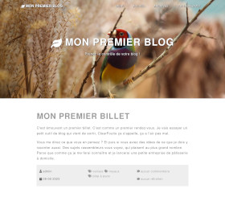

# Simple Grayscale theme for Dotclear

A Dotclear theme based on Start Bootstrap Grayscale template (see below)

[Grayscale](http://startbootstrap.com/template-overviews/grayscale/)

Ce thème utilise le plugin Simple Menu pour la navigation en haut de page.

La configuration du thème permet de choisir :

- l'image de fond utilisée : même image pour toutes les pages, ou image aléatoire. De plus, si le plugin Featured Media est installé, l'image à la une des billets peut être utilisée.
- les icônes de liens vers les médias sociaux

## Copyright and License

Copyright 2013-2015 Iron Summit Media Strategies, LLC. Code released under the [Apache 2.0](https://github.com/IronSummitMedia/startbootstrap-grayscale/blob/gh-pages/LICENSE) license.
